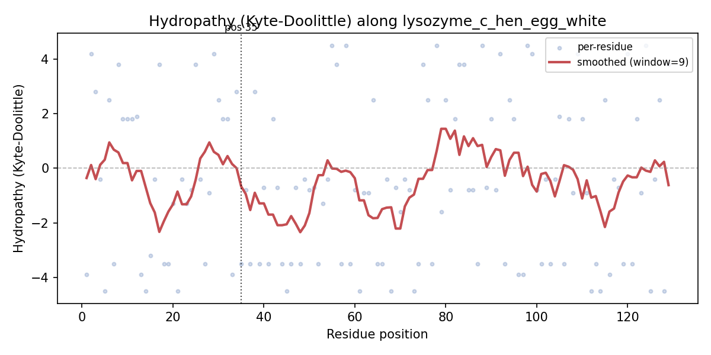
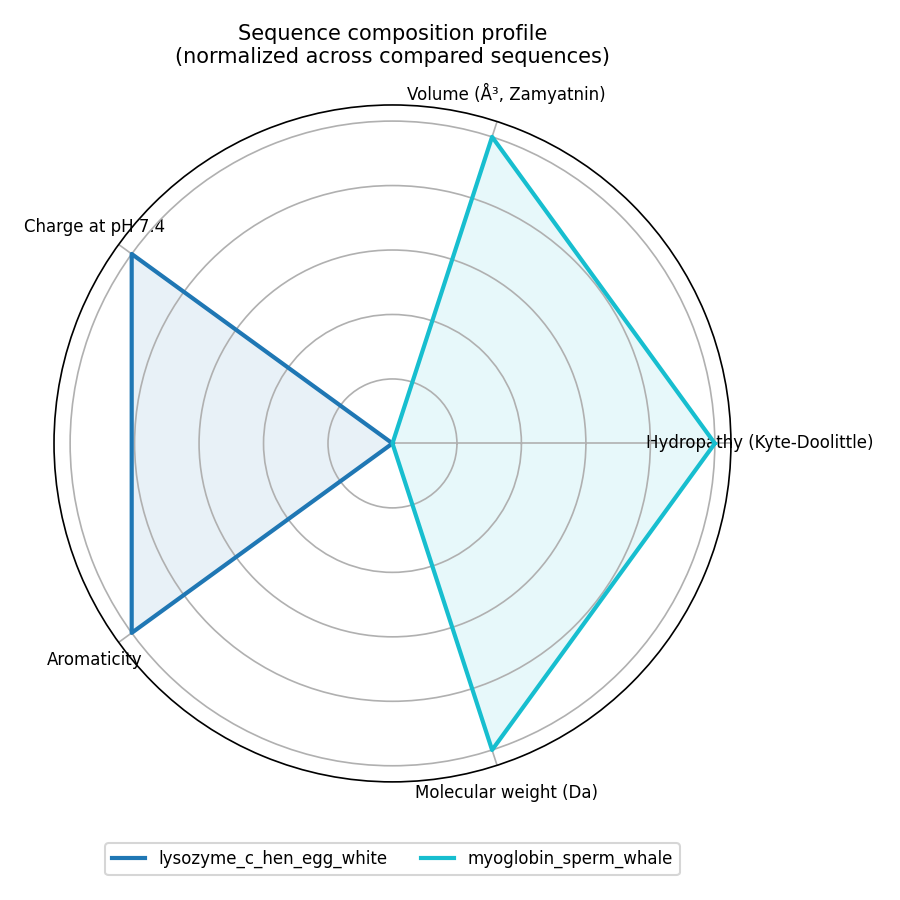

# amino-acid-property-explorer

[](https://github.com/yiweidavidchen/amino-acid-property-explorer/actions/workflows/tests.yml)

**[Try it live →](https://yiweidavidchen.github.io/amino-acid-property-explorer/)** — paste a sequence, pick a property, and optionally test a point mutation, right in the browser. No install needed.

Visualize amino acid physicochemical properties along a protein sequence,
or compare whole-sequence composition across two or more proteins.

No lab-specific data, no heavy dependencies (just matplotlib + numpy) --
works on any sequence you paste in or any public FASTA file.

## What it does

- **Property-along-sequence plots** — the classic Kyte-Doolittle hydropathy
  plot, generalized to any of five properties (hydropathy, volume, charge,
  aromaticity, molecular weight), with sliding-window smoothing so the
  signal is readable instead of noisy per-residue scatter.
- **Composition radar plot** — a "fingerprint" comparing the overall
  physicochemical character of two or more sequences at a glance.
- **Point-mutation delta report** — given a sequence, a position, and a
  target residue, reports how each property shifts (e.g. `E406D`: charge
  delta, volume delta, hydropathy delta).
- **CSV export** — full per-residue property table for further analysis
  elsewhere (Excel, pandas, R, whatever you use).

## Example output

Hydropathy plot (hen egg-white lysozyme, window=9):



Composition radar comparing lysozyme vs. myoglobin:



## Install

```bash
pip install -r requirements.txt --break-system-packages
```

## Usage

```bash
# Plot one property along a sequence, from a raw string
python -m aa_explorer.cli profile --seq MKTAYIAKQRQISFVKSHFSRQ... --field hydropathy -o hydropathy.png

# Plot from a FASTA file (uses first record, or --record to pick by header)
python -m aa_explorer.cli profile --fasta examples/example.fasta --record lysozyme_c_hen_egg_white --field charge -o charge.png

# Export full per-residue table to CSV
python -m aa_explorer.cli export --fasta examples/example.fasta -o profile.csv

# Compare composition of multiple sequences on one radar plot
# (uses every record in the FASTA file)
python -m aa_explorer.cli radar --fasta examples/example.fasta -o radar.png

# Single point-mutation property delta report (1-indexed position)
python -m aa_explorer.cli mutate --seq MKTAYIAK... --position 5 --to D
```

Available `--field` choices for `profile`: `hydropathy`, `volume`, `charge`,
`aromaticity`, `mol_weight`.

## Property reference

Values are standard textbook references (see `aa_explorer/aa_data.py`
docstring for exact sources and caveats):

- **Hydropathy** — Kyte & Doolittle (1982) scale.
- **Volume** — Zamyatnin (1972) residue volume, ų.
- **Charge** — approximate formal charge at pH 7.4. Histidine is
  represented as a fractional charge (0.1) to reflect its partial
  protonation near physiological pH, rather than forcing it to 0 or +1.
- **Aromaticity** — 1.0 for Phe/Trp/Tyr, 0.0 otherwise.
- **Molecular weight** — residue mass in Daltons (amino acid mass minus
  water lost in peptide bond formation).

If you need publication-grade precision, cross-check these against the
primary references rather than trusting the table blind — it's built for
exploratory visualization, not as a citable data source in itself.

## Repo structure

```
amino-acid-property-explorer/
  aa_explorer/
    aa_data.py        # property reference table for the 20 standard AAs
    sequence_io.py      # FASTA parsing + sequence validation
    profiler.py           # per-residue arrays, smoothing, point-mutation deltas
    plotting.py             # line plots + radar plot
    export.py                 # CSV export
    cli.py                      # command-line entry point
  examples/
    example.fasta      # two public sequences (lysozyme, myoglobin) for demos
  docs/
    sample_*.png          # example output images shown above
  tests/
```

## Limitations

- Only the 20 standard amino acid one-letter codes are supported — no
  ambiguity codes (X, B, Z) or non-standard/modified residues.
- Charge model is a simplification (fixed formal charges, no pH titration
  curve) — fine for quick visualization, not a substitute for a real pKa
  calculation if you need one.
